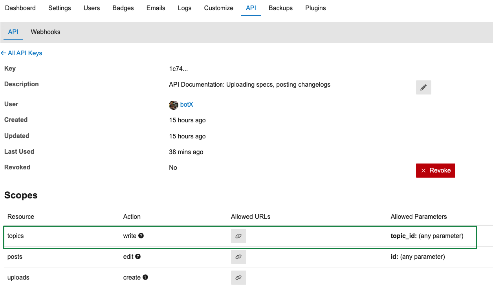

# Post a string or the contents of a file to a Discourse topic

This repository provides a GitHub Action to post a string or the contents of a
given file to a specific Discourse topic.

We use it as part of our API documentation management suite:
[Rapidoc](https://rapidocweb.com/) as a [Discourse](https://discourse.org/)
[theme component](https://github.com/wwerner/discourse-rapidoc-theme-component)
to render [OpenAPI specifications](https://swagger.io/specification/) in forum
posts. We upload specifications using
[this action](https://github.com/grid-x/api-spec-to-discourse-action), create
changelogs with [that one](https://github.com/alexeytokar), snippets with
[this one](https://github.com/grid-x/api-spec-snippets-generator-action), and
finally upload the changelogs with the action from this repository.

## Prerequisites / Inputs

- `discourse_url` - your discourse instance domain, e.g.
  "community.developer.gridx.de
- `discourse_post_id` - the ID of the Discourse post to reply to. You can find
  the ID, e.g., by inspecting your post in the browser and looking for
  `data-post-id="<n>"` in the `article` element. (XPath
  `//article/@data-post-id`) 
- `discourse_api_key` - your discourse API key. It needs `FIXME` permissions.
  
- `discourse_user` - the discourse user on whose behalf the action should be
  executed.
- `github_sha` - the commit hash to put into the post as reference, can be
  obtained using `$GITHUB_SHA` when running in an action or with
  `git rev-parse --short HEAD`
- `content_file` - the (text) file containing the contents to be posted,
  relative to the repositories root. Use either this or `content` directly.
- `content` - the contents to be posted. Use either this or `content_file` to
  load the content from a file. D'uh.

## Instructions

1. ...

## Development

- You can run the action locally using `npm run test:run`, providing the
  configuration parameters through the environment. See
  [test.ts](./src/test.ts).
- See [package.json](./package.json) for linting, testing and formatting
  scripts.
